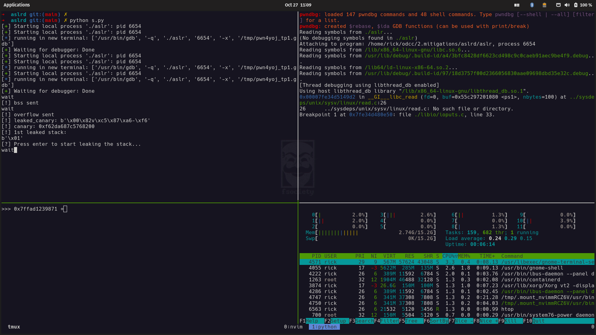

# My tmux set up



Tmux is an awesome terminal multiplexer that make you look like a real hacker. This is my minimal awesome tmux configuration:

## tmux prefix

```bash
# Set prefix to Ctrl
unbind C-b
set -g prefix C-a
```

The prefix is a combiantion of key that initiate any tmux command. For this reason it must be confortable to type over and over.
The first you learn touch typing (writing without looking at the keyboard) is to always keep you hand on the _home row_. 
In fact, from this position, specifically with your index fingers on 'f' and 'j' you have the best access to every key.
That's why on all my setup I always swap the \<Ctrl\> and the Caps Lock key.
Given this premise, it's clear to see why Ctrl-a it's an awesome choice as a tmux prefix.


## Panes navigation and window-splitting

```bash
# Vim-like key bindings for pane navigation (default uses cursor keys).
unbind h
bind h select-pane -L
unbind j
bind j select-pane -D
unbind k
bind k select-pane -U
unbind l # normally used for last-window
bind l select-pane -R

# Intuitive window-splitting keys.
bind ] split-window -h -c '#{pane_current_path}' # normally prefix-%
bind - split-window -v -c '#{pane_current_path}' # normally prefix-"
```

Vim `hjkl` >> every other keybinding.

```bash
# Escape time for NeoVim
set-option -sg escape-time 10
```

NeoVim and tmux may go in contrast, this is to make them work smoothless.
